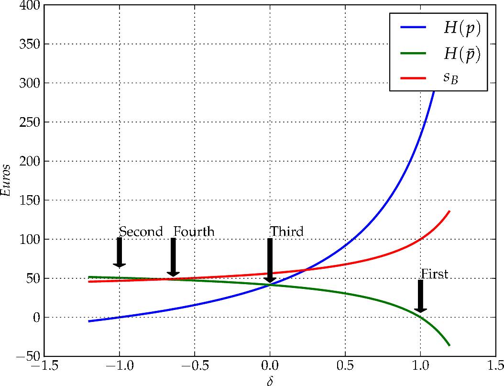

*WARNING: If you decide to copy anything from this page, please 
do not forget to make a proper citation. Feel free to download the 
pdf version available* `here <../article>`_.

Introduction to the Betting Exchange
====================================
Filipe Funenga -- Lisbon, Portugal -- September 18, 2012

.. topic:: Abstract
    
    A basic introduction is made to trading in a betting exchange. 
    Beyond analysing the central system of equations for trading in 
    its matrix form, an equation is provided aiming at a dynamic 
    configuration of the proportion between returns. Also, various 
    approaches are presented, denoting the possibility for a trader 
    to manage the profits based on his expectation of the event.

Betting Exchange
----------------
An online betting exchange is a web service where users can, among 
other things, trade contracts with each other about the outcome of 
future random events. The pay-off of these contracts can either be 
some fixed amount of money or nothing at all. The main innovation of 
this system, compared to traditional bookmakers, lies in providing a 
method to set fixed odds against an outcome -- known as *laying* -- 
and invite other users to bet in favour of the outcome -- know as 
*backing*. This type of freedom had previously been reserved only to 
bookmakers.

The betting exchange concept, envisioned and created by Betfair 
:math:`\textsuperscript{\textregistered}` [1]_ in 2000, has 
revolutionized sports and race wagering, attracting the attention of 
sports bodies, major competitors and governments, who seem uncertain 
about how to deal with this revolutionary transaction system, as 
well as customers globally, who are attracted by the far superior 
value proposition offered. [2]_ Smaller companies exist but Betfair 
:math:`\textsuperscript{\textregistered}` is considered to have a 
virtual monopoly. 

In facilitating betting as a neutral intermediary the company 
responsible for maintaining the exchange generates revenue by taking 
a commission from the winner of the contract. This means that the 
company is only interested in maximizing the amount of money 
transacted between users and that it has no vested interest in the 
outcome of the events. The commission charged is calculated as a 
percentage of net winnings for each customer on each event, or 
market. The final value that the customer will get can be calculated 
with the *house function*, :math:`H`, which is formulated in the 
following manner:

.. math::
    :label: eq:commision
    
    H(x) = \left\{
    \begin{array}{l l}
        x              & \quad \text{if x $\leq$ 0}\\
        x \times (1-h) & \quad \text{if x $>$ 0}\\
    \end{array} \right.

where :math:`h` is the house percentage (normally 0.05).

The neutral position makes customers, whose betting activities have 
traditionally been "restricted" by bookmakers (normally successful 
users that won too much money), able to place bets only limited by 
market liquidity. [3]_

.. _decimalOddsAndProbabilities:

Decimal Odds and Probabilities
------------------------------
Traditional odds in favour of an event, :math:`O_{t}`, is the ratio 
of the probability that an event will happen to the probability that 
it will not happen. For example, the traditional odds that a 
randomly chosen day of the week is a Sunday are one to six, which is 
written :math:`1/6` or 1:6. 

Decimal Odds, :math:`O_{d}`, are simpler to use than traditional 
ones and are the most common form of odds quoted in countries 
outside the UK. Unlike the traditional interpretation, the customer 
stake is included as part of his total return, 
:math:`O_{t}=O_{d}+1`, relating more closely to the concept of 
probability. In the previous example, each day of the week has 
decimal odds of 7.0.

The implied probability of an outcome described by decimal odds, 
equals 1 divided by its odds:

.. math::
    \text{Probability}=\frac{1}{O_{d}}=\frac{1}{O_{t}-1}

which concludes that everyday there is a :math:`\frac{1}{7} = 14.3\%` 
chance of being Sunday.

This means that when a customer makes a bet, he is actually making a 
financial commitment about his expectations on the outcome of an 
event through the implied probability of the bet. As we will see in 
appendix :ref:`expectedVariance`, the expected value of bets depend 
on a relation between the real probability of the event and the 
implicit probability of the bet.

Betting Terminology
-------------------
Various terms are nowadays well established to characterize the way 
betting exchange's customers build their sets of bets.

First of all, clear distinctions arise related to the number of 
betted events. If the set only backs and/or lays one event, than it 
is said that the costumer is *Hedging*. On the contrary, if more 
than one event is betted upon, than its called *Dutching*.

A particular case of *Hedging* is when the costumer only closes one 
bet. This sort of action is known as *Speculating* since the 
costumer's (colloquially called a *punter*) transactions are based on 
hints. For instance, a *punter* will easily close a back bet on a 
single event of a soccer game and wait until the end to see the 
outcome.

*Dutching* also has a special case called *Surebeting*. This happens 
when the events betted upon are collectively exhaustive (all the 
possible events).

    +-------------------------+----------------------------+
    | Number of Betted Events | Terminology                |
    +=========================+============================+
    | Single                  | *Hedging* or *Speculating* |
    +-------------------------+----------------------------+
    | Multiple                | *Dutching* or *Surebeting* |
    +-------------------------+----------------------------+

The closing of bets can be further distinguished based on its 
timing, denoting two well known fashions: *Arbitrage* and *Trading*.

In economics and finance, *Arbitrage* is the practice of taking 
advantage of a price difference between two or more markets: 
striking a combination of matching deals that capitalize upon the 
imbalance, the profit being the difference between the market prices.

In the betting exchange context, it is possible to became an 
*Arbitrageur* when the implied probabilities (see 
:ref:`decimalOddsAndProbabilities`) of all possible events sum up to 
more than one. For instance, in a soccer match the odds available 
for backing :math:`\{\text{Home},\text{Visitor},\text{Draw}\}` are 
:math:`O_{i} = \{1.3, 4.3, 2.3\}`, respectively. This results in a 
total :math:`\sum_{i} \frac{1}{O_{i}} = 1.44` probability which now 
allows to take profit with a *Surebet*. *Arbitrageurs* are 
traditionally known to perform *surebets* on multiple bookmakers. 
The same situation can be performed, although highly unlikely, 
with hedging. 

A *Trader*, someone who performs *Trading*, takes an extra risk and 
closes his bets at different stages when the implied probabilities 
offered by the market turn out to be more favourable.

    +-------------------------+-------------+
    | Generation of Imbalance | Terminology |
    +=========================+=============+
    | Immediate               | *Arbitrage* |
    +-------------------------+-------------+
    | Gradual                 | *Trading*   |
    +-------------------------+-------------+

The Back-Lay Pair
-----------------
The profit/loss of back and lay bets can be represented as random 
variables established by a stake and an implied probability in the 
following manner:

.. math::
    \begin{array}{r c l}
        Back( p_{B}, s_{B} ) & = & \left\{
        \begin{array}{l l}
            s_{B} \times \frac{1-p_{B}}{p_{B}} & \quad
                                           \text{if the event occurs}\\
            s_{B} \times (-1)                  & \quad
                                                 \text{if it doesn't}\\
        \end{array} \right. \\
        Lay( p_{L}, s_{L} ) & = & \left\{
        \begin{array}{l l}
            s_{L} \times \frac{p_{L}-1}{p_{L}} & \quad
                                           \text{if the event occurs}\\
            s_{L}                              & \quad
                                                 \text{if it doesn't}\\
        \end{array} \right.
    \end{array}

where :math:`p_{B}` and :math:`p_{L}` are the implied probabilities 
of the bet, :math:`s_{B}` and :math:`s_{L}` the stakes. The expected 
value and variance of each variable are calculated in 
:ref:`expectedVariance`.

Nowadays, in order to understand if it is possible to make profit 
with this pair of bets, the most common metric used is the 
*greenbook* which is defined has the situation of having positive 
profits in all markets (regardless to the distribution). Although 
this is an acceptable way of evaluating the established situation, a 
more generic metric will tell us if it is possible to make profit, 
which is not enough to satisfy a *greenbook*.

.. math::
    \text{Greenbook} \Rightarrow \text{Possibility of Proffit}
    
    \text{but}
    
    \text{Possibility of Proffit} \not \Rightarrow \text{Greenbook}

The following matrix form is now presented where the two possible 
profits can be calculated with:

.. math::
    :label: eq:pesSystem

    P = E \times S \Leftrightarrow
    \begin{bmatrix}
    p\\
    \bar{p}
    \end{bmatrix} =
    \begin{bmatrix}
        \frac{1-p_{B}}{p_{B}} & \frac{p_{L}-1}{p_{L}}\\
        -1 & 1
    \end{bmatrix}
    \begin{bmatrix}
        s_{B}\\
        s_{L}
    \end{bmatrix}

where :math:`P` is the *profit matrix*, :math:`S` is the *stake 
matrix* and :math:`E` is the *exchange matrix* built from horizontal 
stack of its back and lay columns (:math:`E = \left[ B \mid L 
\right]`).

With the exchange matrix is now possible to make an analysis about 
the value of its determinant:

.. math::
    det(E) = \frac{1-p_{B}}{p_{B}} + \frac{p_{L}-1}{p_{L}} =
                                 \frac{p_{L}-p_{B}}{p_{B} \times p_{L}}

This value is only positive if :math:`p_{L}-p_{B}>0` which is in 
fact the main objective of a trader in single event operations (in 
order to make profit): contradict the nature of the market by 
closing a back bet with lower probability than a lay bet, which is 
the same to say a back odd higher than a lay odd.

Unlike a *greenbook*, the determinant of the exchange matrix gives 
us a more general definition of when the customer will be able to 
make profit.

Hedging
*******
Let the following problem be enunciated:

.. _Problem 1:

.. topic:: Problem 1
    
    At a time :math:`t_{0}` a trader made a lay bet of :math:`100` € 
    (:math:`s_{L}`) with a 3.15 odd (:math:`p_{L}=0.32`). After a 
    while (:math:`t>t_{0}`), the trader is able to make a back bet 
    with a 5.6 odd (:math:`p_{B}=0.18`). How much should the stake 
    :math:`s_{B}` be?

A problem like this can appear when using the *Lay the Draw* 
strategy in the beginning of a soccer game. If a strong team plays 
against a weaker team (colloquially the *underdog*) than the 
probability that the draw at 0-0 will sustain throughout the game is 
naturally low. Obviously, there needs to exist an exit strategy 
(assume the prejudice) for the eventuality that no goal at all is 
scored. Another tragic eventuality that works against this strategy 
is when the *underdog* is the first to score.

The approach described in this section aims to solve `Problem 1`_ 
while managing the distribution of profit/loss over all possible 
events in a dynamic way. `Problem 1`_ has only two possible profits 
that can relate by the following proportion:

.. _tradingeq:
.. math::
    :label: tradingeq
    
    \beta \times H\left( s_{L}-s_{B}\right) = H\left(
         \frac{1-p_{B}}{p_{B}}s_{B} + \frac{p_{L}-1}{p_{L}}s_{L}\right)

where :math:`\beta` is a coefficient that models the proportion 
between profits.

In order to solve this equation, it is important to understand when 
the house commission is applied. In :ref:`alphaone`, a 
demonstration is made proving this equation can be solved has if no 
commission exists. This makes it possible to define the following 
generic relation:

.. topic:: Back-Lay Proportion Rule
    
    In order to achieve a proportion :math:`\beta` between the 
    returns of a back-lay pair of bets, the proportion between 
    stakes must be the following:
    
    .. _genericTradingRelation:
    .. math::
        :label: genericTradingRelation
        
        s_{B} \times \frac{1+p_{B}(\beta -1)}{p_{B}} = s_{L} \times
                                        \frac{1+p_{L}(\beta -1)}{p_{L}} 
    
    where :math:`p_{B}` and :math:`p_{L}` are the implied 
    probabilities of the bets, :math:`s_{B}` and :math:`s_{L}` the 
    stakes.

With this rule, it is now possible to manage the returns with the 
following five conditions.

1. :math:`H(\bar{p})=0`
+++++++++++++++++++++++
The first condition is the easiest one. For this to happen one needs 
to solve :math:`s_{L}-s_{B}=0` making the second stake equal to the 
first. In problem `Problem 1`_ the second stake would be 
:math:`s_{B}=s_{L}=100` €.

2. :math:`H(p)=0`
+++++++++++++++++
Second condition can be achieved by solving 
:math:`s_{B}\times\frac{1-p_{B}}{p_{B}}=s_{L}\times\frac{1-p_{L}}{p_{L
}}` which is equivalent to have :math:`\beta=0`. In `Problem 1`_ 
the second stake would be :math:`s_{B}=46.74` €.

3. :math:`H(p)=H(\bar{p})`
++++++++++++++++++++++++++
The third approach is solved making :math:`\beta=1` in equation 
`genericTradingRelation`_. The last needed stake can be calculated 
with:

.. math::
    \frac{s_{L}}{p_{L}}=\frac{s_{B}}{p_{B}}

which would give :math:`s_{B}=56.25` € with a profit of 41.56 € in 
every market.

4. :math:`\frac{H(p)}{P}=\frac{H(\bar{p})}{1-P}`
++++++++++++++++++++++++++++++++++++++++++++++++
:math:`P` is the trader's expected probability.

In the fourth, we make :math:`\beta=\frac{P}{1-P}`. This relation 
makes the expected profit the same in any possible situation. The 
difficulty here, is to set the value of :math:`P`. A simple solution 
is to use the implicit probability that the market has established 
for the event at that moment: in problem `Problem 1`_, the odd 5.6 
means an implied probability of :math:`P = 0.18`. which gives 
:math:`s_{B}=49.16` € with :math:`H(p)=10.6` € and 
:math:`H(\bar{p})=48.29` €.

5. :math:`\frac{H(p)}{(1+\delta)}=\frac{H(\bar{p})}{(1-\delta)}`
++++++++++++++++++++++++++++++++++++++++++++++++++++++++++++++++
:math:`\beta=\frac{1+\delta}{1-\delta}` where :math:`\delta` is a 
bias operator provided in the following manner:

.. math::
    \left\{
    \begin{array}{l}
        \gamma (1+\delta ) = H(p)\\
        \gamma (1-\delta ) = H(\bar{p})\\
    \end{array} \right.

where :math:`\gamma` is an unknown central profit.

An expected, and obvious, result is that when :math:`\delta 
\rightarrow 0` this relation becomes the same as if :math:`\beta = 1`.

References
----------
.. [1] http://www.betfair.com/

.. [2] Mark Davies, Leyland Pitt, Daniel Shapiro, and Richard 
    Watson. Betfair.com: Five technology forces revolutionize worldwide 
    wagering. European Management Journal, 23:533–541, 2005.

.. [3] Des Laffey. Entrepreneurship and innovation in the uk betting 
    industry: The rise of person-to-person betting. European Management 
    Journal, 23:351–359, 2005.

.. _expectedVariance:

Appendix A -- Expected Value and Variance
-----------------------------------------
First we need to suppose a value to the real probability that the 
event will happen, :math:`P`. Normally a simple solution is to use 
the implied probability that the market has established for the 
event at that moment. More complex approaches can be made with the 
retrieval of probabilistic information from external sources to the 
exchange or with the estimation of a trend of the market.

The expected value of a bet is normally called *the value of the 
bet*. This term is unfortunate since it is easily confused with the 
stake of the bet in languages other than English.

Back
****
The expected value of a back bet with real probability :math:`P` is:

.. math::
    E \left[ Back(p_{B},s_{B}) \right] = \mu_{B} = P \times s_{B} \frac{1-p_{B}}{p_{B}} - (1-P) \times (s_{B}) = s_{B} \left( \frac{P}{p_{B}}-1 \right)

The variance is:

.. math::
    Var \left[ Back(p_{B},s_{B}) \right] = P \left( s_{B}\frac{1-p_{B}}{p_{B}} - \mu_{B} \right)^{2} + (1-P) \left( - s_{B} - \mu_{B} \right)^{2}

Lay
***
The expected value of a lay bet with probability :math:`P` is:

.. math::
    E \left[ Lay(p_{L},s_{L}) \right] = \mu_{L} = P \times s_{L} \frac{p_{L}-1}{p_{L}} + (1-P) \times (s_{L}) = s_{L} \left( 1 - \frac{P}{p_{L}} \right)

The variance is:

.. math::
    Var \left[ Lay(p_{L},s_{L}) \right] = P \left( s_{L}\frac{p_{L}-1}{p_{L}} - \mu_{L} \right)^{2} + (1-P) \left( s_{L} - \mu_{L} \right)^{2}

.. _alphaone:

Appendix B -- Back-Lay Commission Simplification
------------------------------------------------
Observing the behaviour of :math:`H` in equation `tradingeq`_, the 
following conditions are easily noted:

.. math::
    \left\{
    \begin{array}{l}
        C_{1}: s_{L} > s_{B}\\
        C_{2}: \frac{1-p_{B}}{p_{B}}s_{B} > \frac{1-p_{L}}{p_{L}}s_{L} \\
    \end{array} \right.

Equation `tradingeq`_ can now be rewritten in the following way:

.. _alphaBetaTrading:
.. math::
    :label: alphaBetaTrading
    
    \alpha \times \beta \times\left( s_{L}-s_{B}\right) = \frac{1-p_{B}}{p_{B}}s_{B} + \frac{p_{L}-1}{p_{L}}s_{L}

where :math:`\alpha` is

.. math::
    \left\{
    \begin{array}{c l}
        (1-h)         & \quad \text{if } C_{1} \wedge \bar{C_{2}}\\
        \frac{1}{1-h} & \quad \text{if }\bar{C_{1}} \wedge C_{2} \\
        1             & \quad \text{if }( C_{1} \wedge C_{2} ) \vee ( \bar{C_{1}} \wedge \bar{C_{2}} )\\
    \end{array} \right.

The problem now is that :math:`C_{1}` and :math:`C_{2}` depend on 
the values of the stakes, which are the values we are trying to 
model. This said, both conditions will be solved in order to the 
implicit probabilities. Equation `alphaBetaTrading`_ can be 
simplified to the following form:

.. math::
    s_{L} \times \left( \alpha \beta + \frac{1-p_{L}}{p_{L}} \right) = s_{B} \times \left( \alpha \beta + \frac{1-p_{B}}{p_{B}} \right) \Leftrightarrow
    s_{L} = s_{B} \frac{ \alpha \beta + \frac{1-p_{B}}{p_{B}} }{ \alpha \beta + \frac{1-p_{L}}{p_{L}} }

The first condition becomes:

.. math::
    s_{L} > s_{B} \Leftrightarrow
    s_{B} \frac{ \alpha \beta + \frac{1-p_{B}}{p_{B}} }{ \alpha \beta + \frac{1-p_{L}}{p_{L}} } > s_{B} \Leftrightarrow
    \alpha \beta + \frac{1-p_{B}}{p_{B}}  > \alpha \beta + \frac{1-p_{L}}{p_{L}} \Leftrightarrow
    p_{L} > p_{B}

And the second:

.. math::
    \frac{1-p_{B}}{p_{B}}s_{B} > \frac{1-p_{L}}{p_{L}}s_{L} \Leftrightarrow
    \frac{1-p_{B}}{p_{B}} \left( \alpha \beta + \frac{1-p_{L}}{p_{L}} \right) > \frac{1-p_{L}}{p_{L}} \left( \alpha \beta + \frac{1-p_{B}}{p_{B}} \right)  \Leftrightarrow

.. math::
    \Leftrightarrow \alpha \beta \times \frac{1-p_{B}}{p_{B}} > \alpha \beta \times \frac{1-p_{L}}{p_{L}} \Leftrightarrow
    p_{L} > p_{B}

Concluding that :math:`C_{1} \Leftrightarrow C_{2}` which tells us 
that :math:`\alpha=1`.
